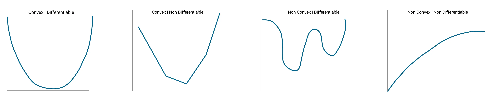
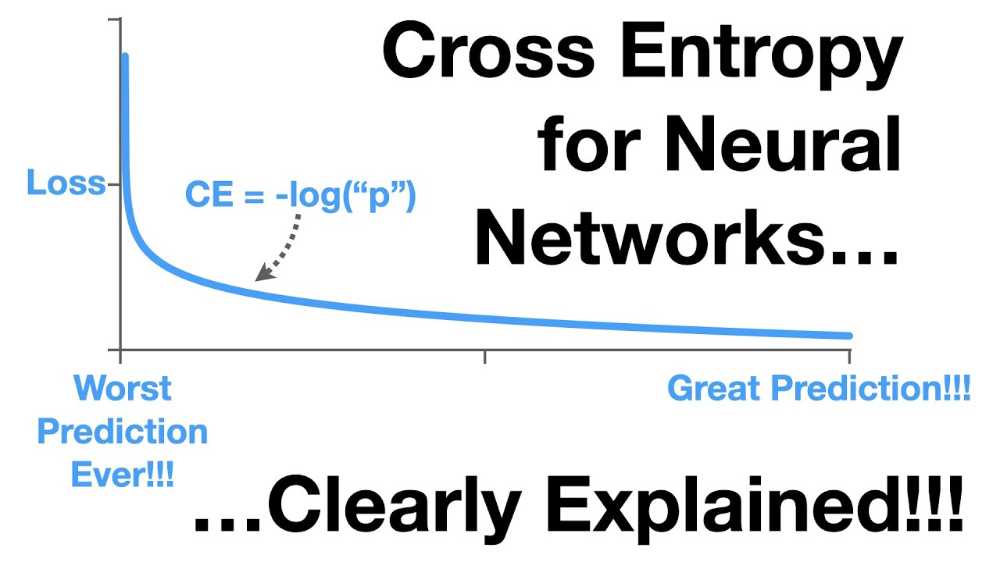
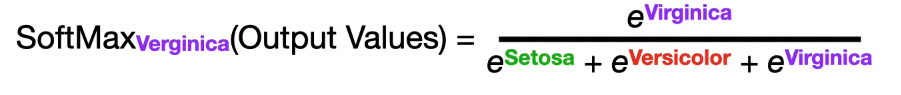

# Basics

- **ArgMax**: can't be used to optimize the weights and biases of the neural network as the argmax is a constant.
- **Cost function**: tells you how good the model is fitting the training data. The more you minimize the cost function, the better the model fit. 
- **Cross entropy**: is the loss function in the format of the log of the probability (normally after softmax). 
- **Gradient of a function**: is the collection of all its partial derivatives organized into a vector.
- **NCHW**: batch N, channels C, height H, width W.
- **Stochastic Gradient Descent**: is a probabilistic approximation of Gradient Descent. It is an approximation because, at each step, the algorithm calculates the gradient for one observation picked at random, instead of calculating the gradient for the entire dataset.
- **SoftMax**: divides the probability of one label over the probabilities of all the labels predicted by the network. 